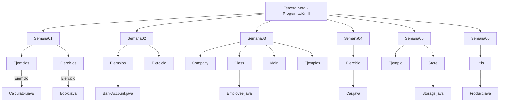

# ☕ Tercera Nota - Programación II

## 📖 Descripción General
Este proyecto recopila todos los **ejemplos y ejercicios prácticos** desarrollados durante el curso de **Programación II**, enfocado en el aprendizaje de la **Programación Orientada a Objetos (POO)** en Java.

A lo largo de las diferentes semanas, se implementan conceptos fundamentales como:
- **Clases y objetos**
- **Encapsulamiento**
- **Herencia**
- **Composición**
- **Constructores**
- **Paso por referencia**
- **Relaciones entre clases**
- **Estructuras de proyectos Java**

---

## 🎯 Objetivo
Aplicar los principios de la **Programación Orientada a Objetos** mediante ejemplos y ejercicios organizados por semanas, desarrollando la lógica, la organización y las buenas prácticas de codificación en Java.

---

## 🗂️ Estructura del Proyecto

El proyecto se divide en carpetas por **semanas**, donde cada una contiene ejemplos (`Ejemplos`) y ejercicios (`Ejercicios`) relacionados con los temas vistos.

```
📦 Tercera-nota-Programacion2
 ┣ 📁 Semana01
 ┃ ┣ 📁 Ejemplos → Calculator.java, Estudiante.java, Student.java...
 ┃ ┗ 📁 Ejercicios → Book.java, Ejercicio_1.java, Main.java
 ┣ 📁 Semana02
 ┃ ┣ 📁 Ejemplos → BankAccount.java, Product.java, Student.java...
 ┃ ┗ 📁 Ejercicio → Store_project.java
 ┣ 📁 Semana03
 ┃ ┣ 📁 Company / Class / Main / Ejemplos
 ┣ 📁 Semana04
 ┃ ┣ 📁 Ejercicio → Car.java, Inventory.java, MainCar.java...
 ┣ 📁 Semana05
 ┃ ┣ 📁 Ejemplo / Store
 ┣ 📁 Semana06
 ┃ ┣ 📁 Utils → Inventory.java, Product.java, Main.java
```

---

## 🧩 Tecnologías Utilizadas
- **Lenguaje:** Java ☕  
- **Entorno de desarrollo:** Visual Studio Code  
- **JDK:** Java Development Kit 21  
- **Paradigma:** Programación Orientada a Objetos (POO)

---

## ⚙️ Ejecución del Proyecto
Para compilar y ejecutar los programas de cada carpeta:

```bash
# Compilar
javac NombreDelArchivo.java

# Ejecutar
java NombreDelArchivo
```

> 💡 *Recomendación:* Ejecuta cada `Main.java` correspondiente a la semana o carpeta para visualizar los resultados de los ejemplos y ejercicios.

---

## 🧠 Diagrama UML General

El siguiente diagrama representa una vista general de la organización del proyecto y la relación entre las carpetas, clases y ejemplos desarrollados.



---

## 👨‍💻 Autor
**Keiner Josue - 192502**  
Estudiante de *Programación II*  
📍 Ocaña, Norte de Santander, Colombia  

---

## 🏁 Conclusión
Este proyecto demuestra la evolución progresiva en el dominio de la **Programación Orientada a Objetos** en Java, reforzando la comprensión de estructuras, relaciones entre clases y buenas prácticas en la organización del código.

---

⭐ *Si te resultó útil este proyecto, considera dejar una estrella en el repositorio o compartirlo con tus compañeros.*
